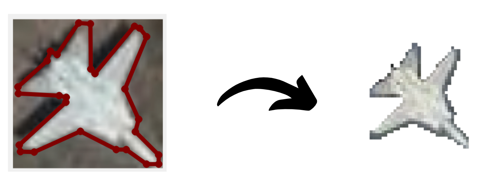

# Transparent-Image-Extraction-using-Mask
 Transparent Image Extraction using Mask

## Introduction
This pipline extract polygon mask as given in `.json` file and extract transparent `.png` image from the original image.



## How to make `.json` files?
You can use [Labelme](https://github.com/wkentaro/labelme) to make `.json` files.
```
pip install labelme
```

## Dataset Structure

### 1. Input Structure
```
├── input
│   ├── 1.jpg
│   ├── 1.json
│   ├── 2.jpg
│   ├── 2.json
...
...
│   ├── n.jpg
│   ├── n.json
```

### 2. Output Structure
```
├── input_result
│   ├── 1.png
│   ├── 2.png
...
...
│   ├── n.png
```

## Usage
```
python main.py
```